# Vehicle Detection and Tracking

## Overview
In this project, I'll write a software pipeline to identify vehicles in a video from a front-facing camera on a car. 

## Project Demo

You can also watch a demo video of this project [on my YouTube]()

## Get the Code
You can download this folder of code [here](https://tugan0329.bitbucket.io/downloads/udacity/car/land-line/p5-vehicle-detection-and-tracking.zip)

## Overview Pipeline

The general steps of this project are the following:

* Perform a Histogram of Oriented Gradients (HOG) feature extraction on a labeled training set of images and train a classifier Linear SVM classifier
* Apply a color transform and append binned color features, as well as histograms of color, to the HOG feature vector. 
* Implement a sliding-window technique and use the trained classifier to search for vehicles in images.
* Run the pipeline on a video stream and create a heat map of recurring detections frame by frame to reject outliers and follow detected vehicles.
* Estimate a bounding box for vehicles detected.

## Detaild Proejct Explanation

### Histogram of Oriented Gradients (HOG)

#### 1. Extract HOG features from training images.

_The code for this step is in the "Histogram of Oriented Gradients (HOG" section of the notebook._

I started by reading in all the `vehicle` and `non-vehicle` images.  Here is an example of one of each of the `vehicle` and `non-vehicle` classes:

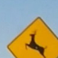

I then explored different color spaces and different `skimage.hog()` parameters (`orientations`, `pixels_per_cell`, and `cells_per_block`).  I grabbed random images from each of the two classes and displayed them to get a feel for what the `skimage.hog()` output looks like.

Here is an example using the `RGB` color space and HOG parameters of `orientations=8`, `pixels_per_cell=(8, 8)` and `cells_per_block=(2, 2)`:

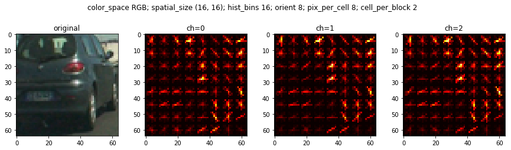

#### 2. Choice of HOG parameters.

_The code for this step is in the "Explore Different Hog Parameters" section of the notebook._

First, I tried various color spaces, and here are the results for each color space.

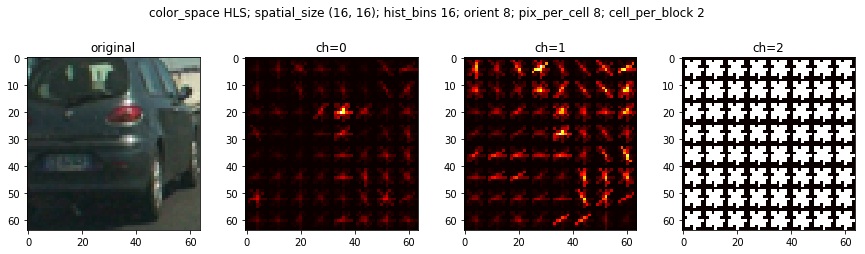

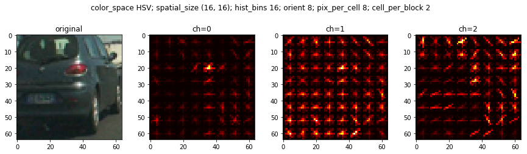

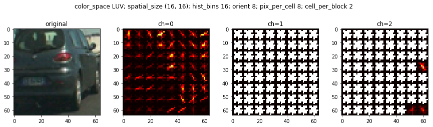

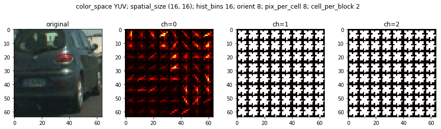

As we can see, RGB, LUV, YUY, and YCrCb first channels perform relatively well and similar to each other, as it depicts a gradient graph similar to a real car.

Then, I tried various combinations of parameters (`orientations, pixels_per_cell, cells_per_block`), and here are the results for each combination.

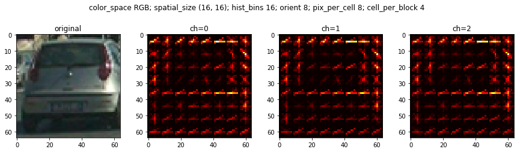

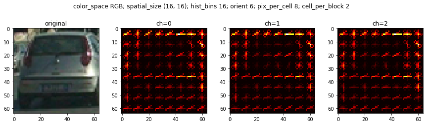

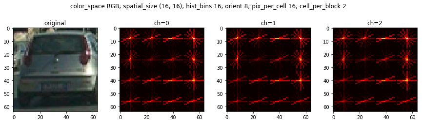

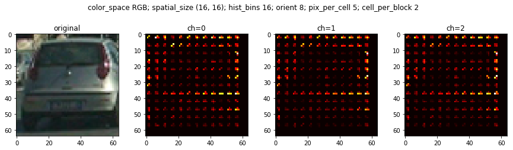

As we can see, cell_per_block doesn't have huge effect, but we definitely don't want too many orient nor pixel_per_cell.

Therefore, combining the results from these experiements, I decided to pursue with `YCrCb` color space, `(16,16)` spatial_size, `32` hist_bins, `9` orient, `(8, 8)` pix_per_cell, `(2,2)` cell_per_block, and only the `first` hog channel. 

#### 3. Color Histogram features

_The code for this step is in the "Explore Color Histogram" section of the notebook._

In addition to the HOG features, I also decided to add color historgram feature, which indicates the color distribution for each picture. Here is an example

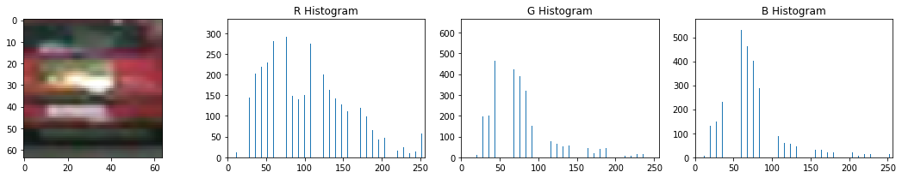

#### 4. Classifier

_The code for this step is in the "Train a classifier" section of the notebook._

I first set out 20% of the training data aside as my test data. Then, I extract a 1 dimensional feature vector for each image in my data, using HOG features and color histogram feature, in addition to image pixels itself. I then normalize these features to have zero mean and unit variance. Lastly, I trained a linear SVC on all the training data, obtaining 98% accuracy. I verifed that my classifer is not overfitting by calculating the test accuracy on test data. I got aronud 98% for test data as well, so we are good. I further verified the classifier performance by manually choosing two random images and check the prediction against ground truth:

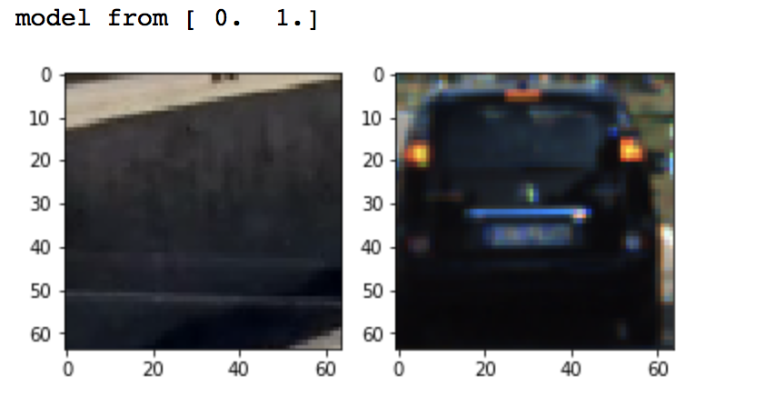

As we can see, it does a pretty good job.

### Sliding Window Search

_The code for this step is in the "Sliding Window Search" section of the notebook._

The high level idea is to search on the images with different bonding boxes, and classify whether there is a car in each sliding window. 

#### 1. Decide on scales and overlap windows to search 

First, I restrict all my search to be within [400, 720] for y axis and [500, 1200] for x axis, because only in these places will cars show up as they are the roads and the lane next to us. In this way, I can avoid more potential false postivies from sky and trees.

Then, I compared search window of size from [32, 32], [64, 64], and [128, 128], and here are the results.

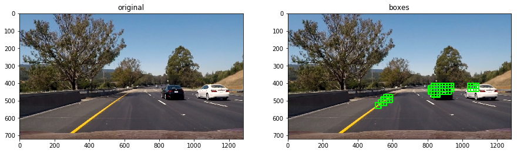

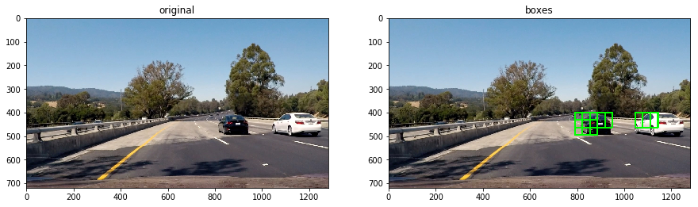

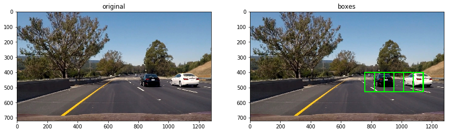

As we can see, as the window size increases, the bonding boxes becomes bigger. The small window size results in way more false positives, but large window sizes result in very few bonding boxes surrounding the car, leading to lower confidence.

After that,  I compared overlap ratio from [0.5, 0.5] to [0.7, 0.7]. 

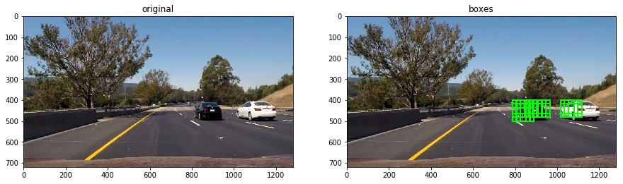

As we can see, the higher the overlap, the higher confidence we have for the region, which is good if we apply a threshold to avoid false positives.

Thus, I decided on using both a window size of 64 with overlap ratio of 0.7 and a window size of 128 with overlap ratio of 0.5 during my sliding window search. 

#### 2. Optimize the performance of the classifier and pipeline

Ultimately I searched on above parameters for HOG features, window size, and overlap ratio. It turns out that my first choice of parameter settings work the best providing a nice result.  Here is an example:

However, there indeed are some areas in the final video where the bonding box is off and floating, it seems to due to the issue of the classifier is unable to identify the car in the following case:

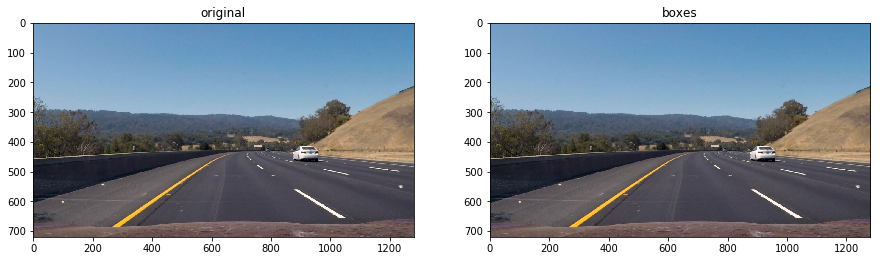

I tried to retrain the classifier with more training data, to change window size, and many other approaches, and for now it is still unable to classify it. I decide to move on at this point, but look back in future, or with other classifiers like a CNN.

---

### Video Implementation

#### 1. Video output

Here's a [link to my video result]()

#### 2. Avoid false positives and combine overlapping bounding boxes

I recorded the positions of positive detections in each frame of the video.  From the positive detections I created a heatmap and then thresholded that map to identify vehicle positions.  I then used `scipy.ndimage.measurements.label()` to identify individual blobs in the heatmap.  I then assumed each blob corresponded to a vehicle.  I constructed bounding boxes to cover the area of each blob detected.  

Here's an example result showing the heatmap from a series of frames of video:

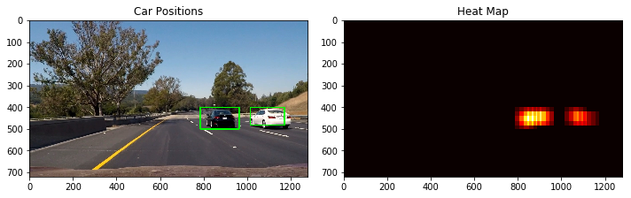

**Here the resulting bounding boxes are drawn onto the last frame in the series:**

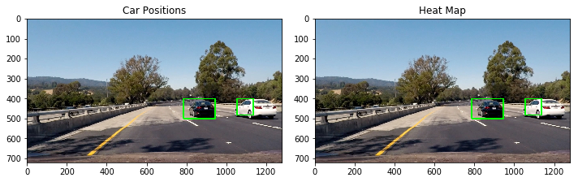

I also keep track of bonding boxes found from previous timestamps, and use them in the heatmap for bonding box prediction, as a way to smooth out variability from classifier. This is to enforce the idea that vehicles appeared in one frame should still be around at the same position in the next frame.

---

### Discussion

There indeed are some areas in the final video where the bonding box is off and floating, it seems to due to the issue of the classifier is unable to identify the car in the following case:

I tried to retrain the classifier with more training data, to change window size, and many other approaches, and for now it is still unable to classify it. I decide to move on at this point, but look back in future, or with other classifiers like a CNN.

Also, in the training image, there are lots of timeseries images of the car in the GTI dataset, so it would be a good idea to retrain the classifier on a filtered training data without too much time series images, in order to avoid overfitting.

