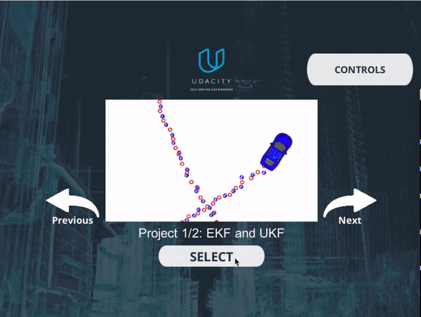

# Unscented Kalman Filter

[](http://www.udacity.com/drive)

## Overview
In this project, I'll utilize an unsecented kalman filter to estimate the state of a moving object of interest with noisy lidar and radar measurements. 

Specifically, I'll improve my [Extended Kalman Filter](https://github.com/Michael-Tu/Udacity-Self-Driving-Car/tree/master/p6-extended-kalman-filter) project to make the vehicle position estimation much more accurate. 

I'll do so by implementing an Unscented Kalman Filter using the Constant Turn Rate and Velocity Magnitude (CTRV) motion model.

I'll demonstrate the performance of my Kalman Filter by showcasing the estimation results on some bicycle simulation data set.

## Project Demo



You can also watch a demo video of this project [on my YouTube](https://youtu.be/f3zx71CJNAY)

**Visual Markers**

**Lidar** measurements are **Red** circles;

**Radar** measurements are **Blue** circles with an arrow pointing in the direction of the observed angle;

**Estimation markers** by Kalman Filters are **Green** triangles.


## Get the Code
You can download this folder of code [here](https://tugan0329.bitbucket.io/downloads/udacity/car/kalman-filter/p7-unscented-kalman-filter.zip)

## Project Setup

This project involves the Simulator which can be downloaded [here](https://github.com/udacity/self-driving-car-sim/releases)

This repository includes two bash files (`install-mac.sh` and `install-ubuntu.sh`) that can be used to set up and install [uWebSocketIO](https://github.com/uWebSockets/uWebSockets) for either Linux or Mac systems. 

For windows you can use either Docker, VMware, or even [Windows 10 Bash on Ubuntu](https://www.howtogeek.com/249966/how-to-install-and-use-the-linux-bash-shell-on-windows-10/) to install uWebSocketIO. 

For more detailed environment setup guide, please refer to [this folder](https://github.com/Michael-Tu/Udacity-Self-Driving-Car/tree/master/p6-extended-kalman-filter/setup-guide) for detailed setup instructions.

## Run the Project

Once the install for uWebSocketIO is complete, the main program can be built and run by doing the following from the project top directory.

```
mkdir build
cd build
cmake ..
make
./UnscentedKF
```
Then, you can open the [Simulator you downloaded](https://github.com/udacity/self-driving-car-sim/releases) and choose "Project 1/2" to run the project.

## Generating Additional Data

This is optional!

If you'd like to generate your own radar and lidar data, see the
[utilities repo](https://github.com/udacity/CarND-Mercedes-SF-Utilities) for
Matlab scripts that can generate additional data.


